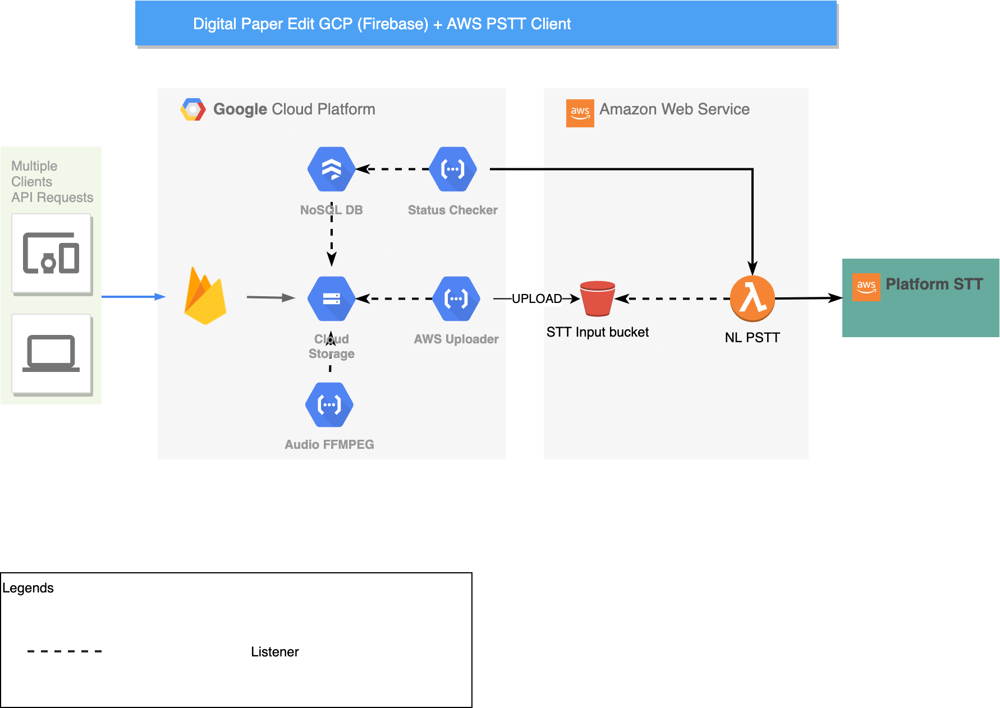

# Digital Paper Edit - Firebase

An application to make it faster, easier and more accessible to edit audio and video interviews using automatically generated transcriptions form STT service.

See [intro](./docs/intro.md) for more info on the project. And [user journey](./docs/user-journey/user-journey.md) for a high level overview of the user journey.

## Development

### Fork: API and Client

A fork of the [client](https://github.com/bbc/digital-paper-edit-client) and [API](https://github.com/bbc/digital-paper-edit-api) is still being developed in the open, in **separate forks: [client](https://github.com/pietrop/digital-paper-edit-client) and [API](https://github.com/pietrop/digital-paper-edit-api)**, thanks to @pietrop.

We don't want the opensource collaboration to stop, so we will be pulling in changes from the forks. If there's a valuable feature that we haven't yet implemented from the fork, please open an issue in **[this repo](https://github.com/bbc/digital-paper-edit-firebase)** or get in touch with us!

#### Collaborating across forks

We will look at the changes in the [fork](https://github.com/pietrop/digital-paper-edit-client) and manually add them to our [firebase version](https://github.com/bbc/digital-paper-edit-firebase).

When manually adding changes to the changes from a fork - there are challenges of pulling in dependencies, such as:

```javascript
[
  ("@bbc/aes31-adl-composer": "^1.0.1"),
  ("@bbc/digital-paper-edit-react-components": "^1.3.2"),
  ("@bbc/fcpx-xml-composer": "^1.0.0"),
  ("@bbc/react-transcript-editor": "^1.4.0")
];
```

These dependencies (non-exhaustive) they might've been forked also. In this case, this is a matter of updating the BBC's version with the newest changes from the dependency's forks and making sure everything works together.

For understanding the approach see [this PR](https://github.com/bbc/digital-paper-edit-client/pull/94).

### Current project board

- [~~BBC News Labs - Digital Paper Edit - Sprint Board~~](https://github.com/orgs/bbc/projects/47)
- [BBC News Labs - Digital Paper Edit 2WOT - Sprint Board](https://github.com/orgs/bbc/projects/54)

The project is divided into [concurrent milestones as described here](https://github.com/bbc/digital-paper-edit-client/milestones) with UX being an overarching milestone that cuts across these different parts.
See [UX Approach](./docs/guides/ux-approach.md) in docs guides for more information on the UX development process.

## Project Architecture

This is a simplified version of the [`bbc/digital-paper-edit-client`](https://github.com/bbc/digital-paper-edit-client) application, using Firebase.
There are many moving parts in this project, but Firebase is self-contained. If you want to see all the projects you can also look at them as a list [here](https://github.com/topics/digital-paper-edit). Most React Components are developed, maintained and imported from [`bbc/digital-paper-edit-react-components`](https://github.com/bbc/digital-paper-edit-react-components). There is a [Storybook demo website](https://bbc.github.io/digital-paper-edit-storybook/) in the repo that you access to view the components. If you want to develop with a local version of the React Components, see [here](https://github.com/bbc/digital-paper-edit-firebase/blob/master/docs/guides/npm-link.md).

See docs in ADR for an understanding of the architectural decisions made. If you'd like some information on Firebase, please read [Firebase ADR](./docs/ADR/2019-11-05-firebase.md) and the [Modular Architecture ADR for more info on the implementation](./docs/ADR/2019-05-09-modular-architecture.md)



## Versioning

The projects use [npm semantic versioning](https://docs.npmjs.com/about-semantic-versioning)

## Setup

This project uses `yarn` `>v1.19.1` instead of `npm`. You can install it from [here](https://classic.yarnpkg.com/en/docs/install/#mac-stable)

## Configuration

[`.env`](./.env) contains environment variables setting up against the `dev` environment. You can copy over the `.env.example` to start.
`REACT_APP_NAME` is used in browser title and navbar component.

```bash
REACT_APP_NAME="digital-paper-edit"
REACT_APP_NODE_ENV="development"
REACT_APP_PROTOTYPE_BY="BBC News Labs"
REACT_APP_PROTOTYPE_BY_LINK="http://bbcnewslabs.co.uk"
```

### Firebase specific configuration

[This doc from Firebase is handy to understand the variables](https://firebase.google.com/docs/web/setup)

```js
let firebaseConfig = {
  apiKey: "api-key",
  authDomain: "project-id.firebaseapp.com",
  databaseURL: "https://project-id.firebaseio.com",
  projectId: "project-id",
  storageBucket: "project-id.appspot.com",
  messagingSenderId: "sender-id",
  appId: "app-id",
  measurementId: "G-measurement-id",
};

```
If you do change this and you want Travis to run deployment, you will need to encrypt it using Travis CLI's `encrypt-file` feature and recommit `.env.enc`.

## Local Development

You must setup the Firebase credentials in order to develop the project - as mentioned in above [section](#Firebase-specific-configuration). If you are BBC staff, please sign into the corporate GCP account. Firebase can be free, but some parts of the app may not work. 
In root of the project (`cd digital-paper-edit-firebase`):

```sh
yarn start
```

which maps to `"run-p --race dev:firebase dev:react",`

This will start two servers: proxy (`3000`) and Firebase server (`4000`). You should have an entry point app running in port `3000`. **Note that this is accessing real data, rather than a dummy one.** We are trying to resolve this in [#31](https://github.com/bbc/digital-paper-edit-firebase/issues/31)

```js
{
    "dev:firebase": "firebase serve -p 4000",
    "dev:react": "cross-env REACT_APP_NODE_ENV=development react-scripts start",
}
```

### Local version of React Components (DPE-Storybook)
If you want to develop with a local version of the React Components, see [here](https://github.com/bbc/digital-paper-edit-firebase/blob/master/docs/guides/npm-link.md).

## Production and Deployment

See Configuration step above and configure `firebase.json`, `.firebaserc` to change the sitename and environment. The deployment will be done via [`Travis CI`](https://travis-ci.org/github/bbc/digital-paper-edit-firebase)

To deploy to development environment:

```sh
yarn deploy:dev:hosting
```

To deploy to production environment:

```sh
yarn deploy:prod:hosting
```

Both steps will remove the build folder, rebuild and deploy, using `firebase cli tools`. You must ensure that Firebase is installed globally (`npm i -g firebase-tools`).

Read more about [Firebase](https://firebase.google.com/) and initialising [here](https://firebase.google.com/docs/cli).

## System Architecture

React is setup using [Create React App](https://facebook.github.io/create-react-app/docs/getting-started).

> You can learn more in the [Create React App documentation](https://facebook.github.io/create-react-app/docs/getting-started).
>
> To learn React, check out the [React documentation](https://reactjs.org/).

## Development env

- [ ] npm > `6.1.0`
- [ ] node v 10 - [lts/dubnium](https://scotch.io/tutorials/whats-new-in-node-10-dubnium)
- [ ] see [`.eslintrc`](./.eslintrc) in the various packages for linting rules

Node version is set in node version manager [`.nvmrc`](https://github.com/creationix/nvm#nvmrc)

<!-- TODO: Setup eslint in express server -->

## Documentation

See [docs](./docs) folder

- [`docs/features-list`](./docs/features-list.md) overview of main features of the app.
- [`docs/user-journey/user-journey.md`](./docs/user-journey/user-journey.md) overview of main features of the app.
- [`docs/notes/`](./docs/notes/) contains unsorted dev notes on various aspects of the project (think of it as drafts).
- [`docs/guides/`](./docs/guides/) contains good to know/how to on various aspects of the project.
- [`docs/adr/`](./docs/adr/) contains [Architecture Decision Record](https://github.com/joelparkerhenderson/architecture_decision_record).

> An architectural decision record (ADR) is a document that captures an important architectural decision made along with its context and consequences.

We are using [this template for ADR](https://gist.github.com/iaincollins/92923cc2c309c2751aea6f1b34b31d95)

<!--
[There also QA testing docs](./docs/qa/README.md) to manual test the component before a major release, (QA testing does not require any technical knowledge). -->

## Build

```sh
yarn build
```

Build of react client side will be in `build`

> Builds the app for production to the `build` folder.<br>
> It correctly bundles React in production mode and optimizes the build for the best performance.
>
> The build is minified and the filenames include the hashes.<br>
> Your app is ready to be deployed!

## Tests

Test coverage using [`jest`](https://jestjs.io/), to run tests

```sh
npm run test
```

During development you can use

```
npm run test:watch
```

> Launches the test runner in the interactive watch mode.<br>
> See the section about [running tests](https://facebook.github.io/create-react-app/docs/running-tests) for more information.

<!-- See README for individual packages for more details -->

<!-- ## Travis CI

On commit this repo uses the [.travis.yml](./.travis.yml) config tu run the automated test on [travis CI](https://travis-ci.org/bbc/react-transcript-editor). -->

## Contributing

See [CONTRIBUTING.md](./CONTRIBUTING.md) guidelines and [CODE_OF_CONDUCT.md](./CODE_OF_CONDUCT.md) guidelines.

## Licence

<!-- mention MIT Licence -->

See [LICENCE](./LICENCE.md)

## Legal Disclaimer

_Despite using React and Firebase, the BBC is not promoting any Facebook products or other commercial interest._
