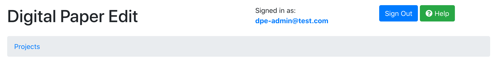
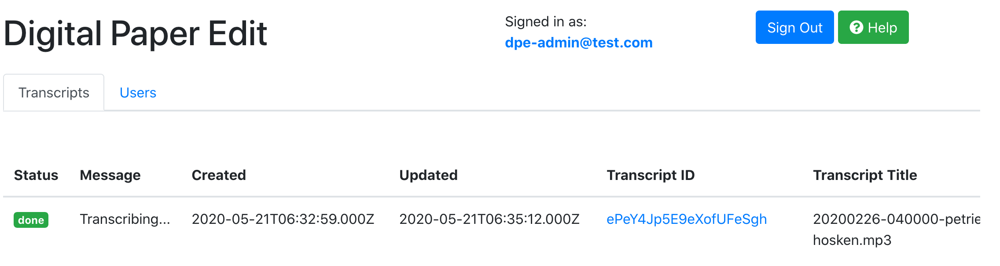
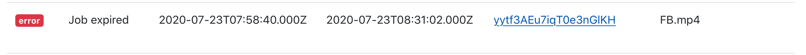
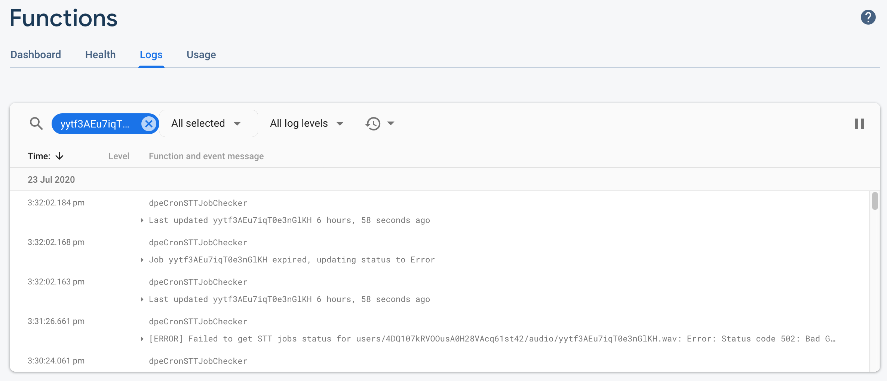
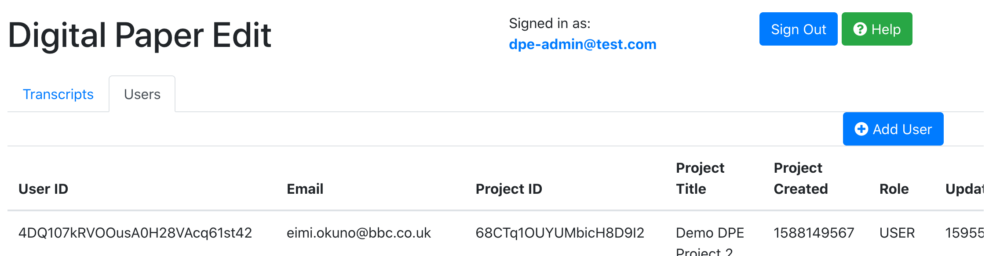

# Admin View

DPE has an Admin View, that can only be accessed if you have "ADMIN" access.
What this essentially means is that you have the power to view all the progress of transcripts and add users in DPE.

## Why

One of the challenges with debugging the problems with the transcripts is the UUID's. It's difficult to tell which is what, who owns what, and who is who.
This dashboard allows you to join up the information in a meaningful way, that helps you identify the necessary information to debug an issue.

## Features

You can access via selecting your email address. E.g. in the image below, access the Admin view by clicking `dpe-admin@test.com`.

### Transcripts View

You can view the following fields in the Transcripts View

| Status | Message | Created | Updated | Transcript ID | Transcript Title | Project ID | Project Title | Transcription Duration (Dhms) | Duration (Hms) | Size (bytes) | File location | Media Type |
| ------ | ------- | ------- | ------- | ------------- | ---------------- | ---------- | ------------- | ----------------------------- | -------------- | ------------ | ------------- | ---------- |

#### Note

The `Message` is only useful for when the `Status` is either `in-progress` or `fail` or `error`.
E.g. the `Message` may say "Transcribing..." but the `Status` might say `done`.
This indicates that the transcription is actually complete.

#### Debug with ease

By clicking on the transcript ID, it will take you to the `Firebase Functions Console` with the field to search prefilled.
This will help to debug the problematic transcript faster.

1. Select ID
   
2. Go to Firebase's Function Console to find the problem
   

### Users View

You can view the following fields in the Users View
| User ID | Email | Project ID | Project Title | Project Created | Role | Updated | Access |
| ------- | ----- | ---------- | ------------- | --------------- | ---- | ------- | ------ |

#### Add User

You can also add a user via the User View. See [the doc for that](./create-new-users.md).

## Technical: Admin access

### Firestore

In the `users` Collections of Digital Paper Edit, if your user document's `role` is `ADMIN`, then you have Admin powers.

#### Firestore Security Rules

[Firestore Security Rules](../../firestore.rules) also determine whether a user can read or write on the database.

### UI

In the [Admin Component](../../src/App.js), you should see a line that determines whether you can access the admin view by a button.
