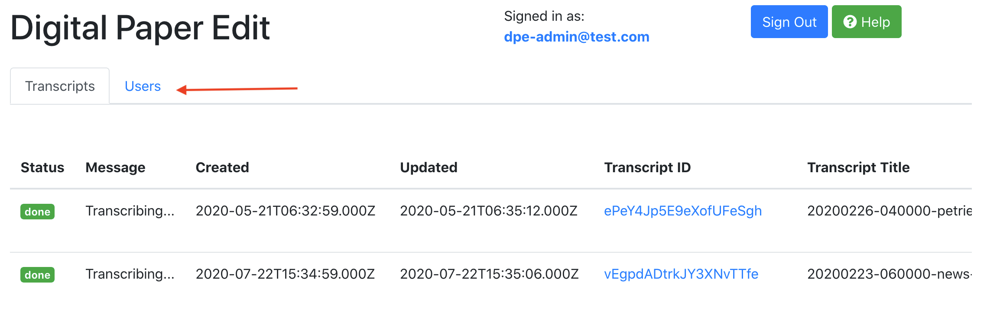
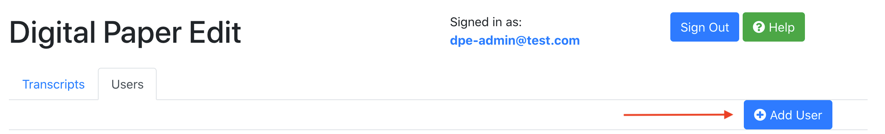
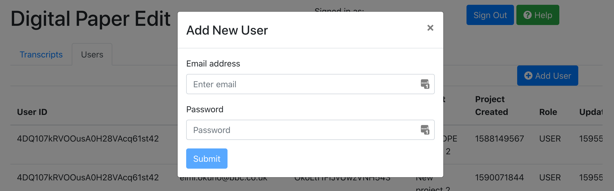
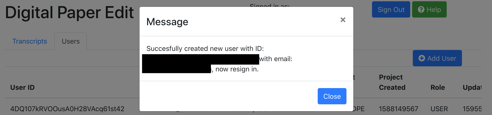
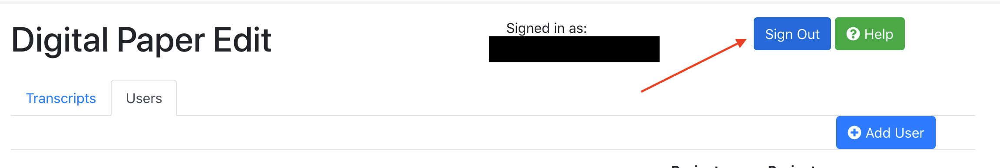

# Adding new users to DPE

Created: 05/05/2020
Updated: 24/07/2020

You can either go through the Firebase Console or DPE's Admin view to create new Users.
If you know the Admin email and password, the easiest way is to add a new user via the Admin View.

## DPE's Admin View

1. Select Users Tab
   
2. Add User
   
3. Fill in the new user's email and password (make sure the password is longer than 8 letters)
   
4. You'll get a feedback message.
   
5. If the user has been successfully created, you will be now logged in as that user. This is because we are using a [method](https://firebase.google.com/docs/reference/js/firebase.auth.Auth#createuserwithemailandpassword) that behaves this way, so make sure you sign out!
   

## Firebase Console

1. In the [Firebase console](https://console.firebase.google.com/u/1/project/newslabs-dev-aa20/authentication/users), click on `Authentication` on the left-hand navigation menu.

   

1. Click on `Add User` in the upper-right.

1. Enter their email address and a password and click the `Add User` buttton below.

   

1. Done! The new user can now sign in with their new username and password.
