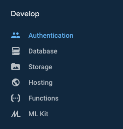
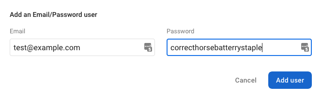
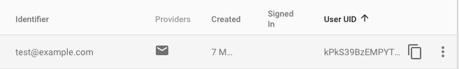
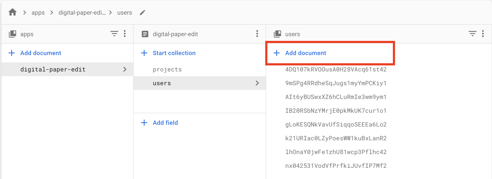
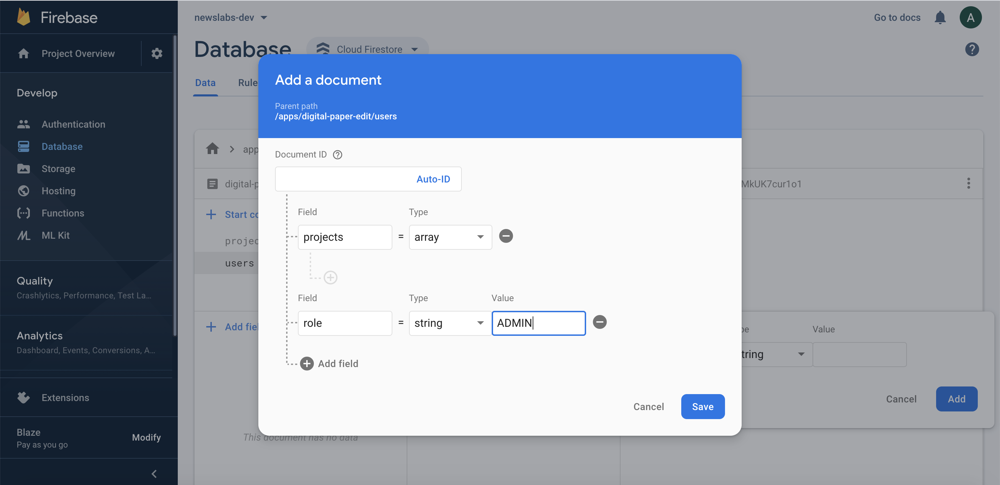
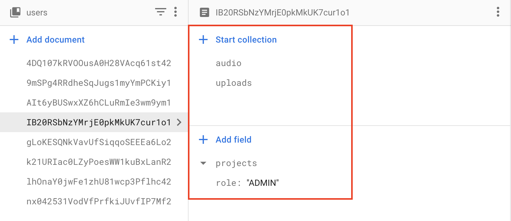

# Adding new users to DPE
05/05/2020

1. In the Firebase console, click on `Authentication` on the left-hand navigation menu.

    

1. Click on `Add User` in the upper-right.

1. Enter their email address and a password and click the `Add User` buttton below. 

    

1. Copy the `User UID` value from the table. 

    

1. Navigate to `Database` on the left-hand navigation menu.

1. In the database view, select: `digital-paper-edit` > `users` > `Add document`.

    

1. Enter the user's UID value in the `Document Id` field in the modal. 

1. Add the following to the document:

    - `projects`: []
    - `role`: 'ADMIN'

    

1. In the database view, create two new collections called `audio` and `uploads`. Leave these empty. 

    

1. Done! The new user can now sign in with their new username and password.